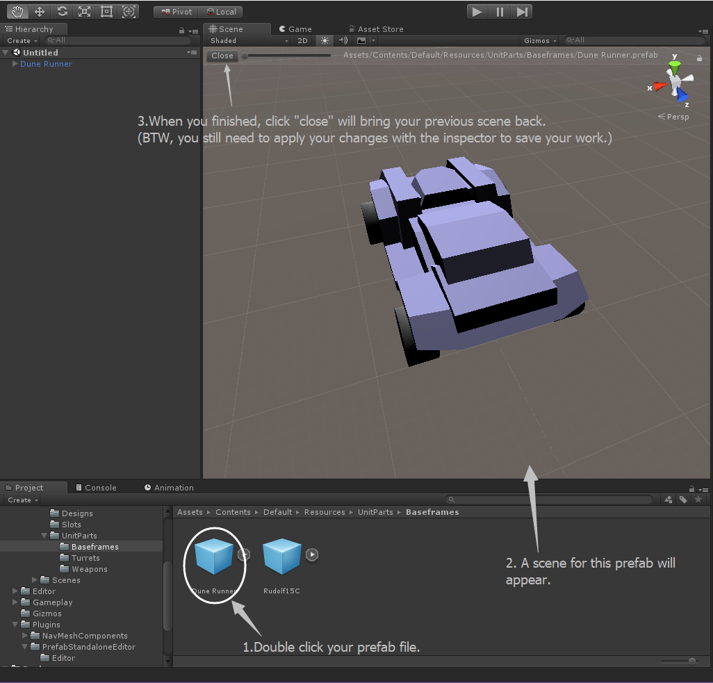

# PrefabStandaloneEditor

This is a unity editor plugin trying to make the prefab editing easier.

Unity itself lacks a standalone prefab editor window, when you want to edit a prefab, you normally needs to drag it into a scene first. Sometimes this will not be a comfortable method, for example, when you want to edit a character, equipment or item, which will be instantated at runtime and should not be inside any scenes.

Some people workaround this problem by add extra scenes for prefab editing, but this plugin may help things go much easer than this.

With this plugin, juse one double click on your ".prefab" file, you can have the prefab loaded into a fresh clean temporary scene to edit with, and of course there will be a close button to navigate you back to the previous scene when you are finished.(if it doesn`t, you will need to double click your scene to open it again.)

For now, you still need to click "Apply" button to save your work.

